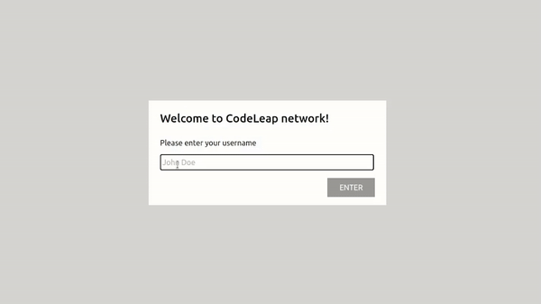

# CodeLeap Engineering Test

Este projeto trata-se de uma aplicação Web para o cadastro de Posts.

Após o usuáro fazer login com seu nome, é redirecionado para uma tela onde pode Criar Posts usando o botão CREATE. Após informar o título e conteúdo, o post é renderizado com o seu nome de login e o a indicação da hora que foi feita.

Caso o Post seja de sua autoria os ícones de Edição e Remoção serão mostrados na tela



## Tecnologias Utilizadas

 


 


## Instalando dependências

```bash
npm install
```

## Executando aplicação

```bash
npm start
```

## Executando os testes

> :warning: Será aberto no seu navegador o Cypress, após aberto selecione o arquivo `logins.spec.js`

```bash
npm test
```

## Contato

<div>
   <a href="https://www.linkedin.com/in/walmirlucena/" target="_blank"></a>
  <a href="walmirlucena3@gmail.com" target="_blank"></a>

 </div>